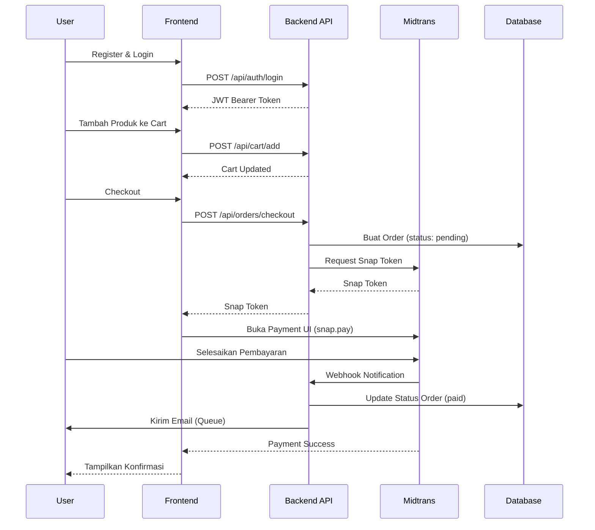

<div align="center">

# 💳 Payment Gateway API

### Backend E-Commerce dengan Integrasi Payment Gateway Midtrans

[](https://laravel.com)
[](https://www.php.net/)
[](https://www.postgresql.org/)
[](https://www.docker.com/)
[](#testing)
[](docs/CICD_DEPLOYMENT_TUTORIAL.md)

[🚀 Live Demo](#) • [📖 Dokumentasi API](http://localhost:8000/api/documentation) • [📊 Arsitektur](#arsitektur) • [🧪 Testing](#testing) • [⚙️ CI/CD](docs/CICD_DEPLOYMENT_TUTORIAL.md)

</div>

---

## 📌 Tentang Project

**Backend API lengkap** untuk aplikasi e-commerce dengan sistem pembayaran menggunakan **Midtrans Snap**, dibangun dengan prinsip **Clean Architecture** dan fitur production-ready seperti automated testing, queue system, task scheduling, dan Docker containerization.

**🎯 Tujuan Project**: Mendemonstrasikan kemampuan development Laravel tingkat enterprise dengan fokus pada **skalabilitas**, **kemudahan testing**, dan **maintainability**.

### ✨ Fitur Unggulan

- 🏗️ **Clean Architecture** - Repository Pattern, Service Layer, DTOs
- 🧪 **52 Automated Tests** - Test coverage lengkap dengan Pest/PHPUnit
- 🔄 **Queue System** - Proses email async, penanganan webhook
- ⏰ **Task Scheduler** - Pengingat order otomatis, cleanup jobs
- 🐳 **Docker Ready** - Multi-container setup untuk development & production
- 📚 **Dokumentasi API** - Dokumentasi interaktif Swagger/OpenAPI
- 🔒 **Security First** - Autentikasi JWT, API rate limiting, validasi input
- 💾 **Transaction Safety** - Database transactions, rollback saat gagal

---

## 🚀 Fitur Lengkap

### 🔐 Autentikasi & Otorisasi
- **JWT Authentication** dengan tymon/jwt-auth
- **RBAC (Role-Based Access Control)** menggunakan Spatie Permission
- 3 Role: Admin, Customer, Merchant
- Password hashing dengan bcrypt
- Token refresh & revocation

### 🛒 Sistem Keranjang Belanja
- Tambah/Update/Hapus produk dari cart
- Validasi stok real-time
- Cart persistence across sessions
- Checkout multi-item sekaligus

### 📦 Manajemen Order
- Lifecycle order lengkap (Pending → Paid → Processing → Completed)
- History order dengan filtering
- Update status order otomatis
- Pembatalan order dengan restorasi stok

### 💳 Integrasi Pembayaran
- Integrasi **Midtrans Snap**
- Multiple metode pembayaran (Kartu Kredit, E-Wallet, Transfer Bank)
- Penanganan webhook notification
- Verifikasi & keamanan pembayaran
- History transaksi

### 📧 Notifikasi Email
- Email konfirmasi order
- Update status pembayaran
- Proses email async dengan queue
- Pengingat otomatis untuk order belum dibayar

### 🖼️ Manajemen Produk
- CRUD operasi produk
- Support multiple gambar produk
- Tracking & manajemen stok
- Kategori & pricing

### 📊 Admin Dashboard API
- Statistik order
- Laporan revenue
- Manajemen user
- Tracking inventory produk

---

## 🏗️ Arsitektur

Project ini mengikuti prinsip **Clean Architecture** dengan pemisahan concerns yang jelas:

```
┌─────────────────────────────────────────────────────────┐
│                  API Layer (Routes)                      │
├─────────────────────────────────────────────────────────┤
│              Controllers (HTTP Handling)                 │
├─────────────────────────────────────────────────────────┤
│         Requests (Validation) │ Resources (Response)     │
├─────────────────────────────────────────────────────────┤
│              Services (Business Logic)                   │
├─────────────────────────────────────────────────────────┤
│         Repositories (Data Access Abstraction)           │
├─────────────────────────────────────────────────────────┤
│              Models (Eloquent ORM)                       │
├─────────────────────────────────────────────────────────┤
│                    Database                              │
└─────────────────────────────────────────────────────────┘
```

**Keuntungan:**
- 🔄 Mudah di-test (mockable dependencies)
- 🔧 Mudah di-maintain (single responsibility)
- 🚀 Mudah di-extend (open-closed principle)
- 🔌 Framework agnostic (switchable data layer)

---

## 🛠️ Tech Stack

| Teknologi | Versi | Kegunaan |
|-----------|-------|----------|
| **Laravel** | 12.x | PHP Framework |
| **PHP** | 8.4 | Bahasa Pemrograman |
| **PostgreSQL** | 16 | Database Utama |
| **Redis** | 7 | Cache & Queue Backend |
| **Docker** | 29.1.2 | Containerization |
| **JWT (tymon/jwt-auth)** | 2.2 | API Authentication |
| **Spatie Permission** | 6.23 | RBAC (Role Management) |
| **Midtrans** | 2.x | Payment Gateway |
| **Guzzle** | 7.x | HTTP Client |
| **MailHog** | - | Email Testing (Dev) |

---

## 🐳 Quick Start dengan Docker (Rekomendasi)

### Prerequisites
- Docker Desktop terinstal ([Download](https://www.docker.com/products/docker-desktop))
- Git terinstal

### Jalankan dengan 3 Command

```bash
# 1. Clone & masuk ke folder
git clone <url-repo-anda>
cd payment-gateway-simple-api-

# 2. Start semua container (Laravel, PostgreSQL, Redis, MailHog)
docker-compose -f docker-compose.dev.yml up -d

# 3. Jalankan database migrations
docker-compose -f docker-compose.dev.yml exec app php artisan migrate --seed
```

**🎉 Selesai!** API tersedia di: http://localhost:8000

**Services yang Berjalan:**
- 🌐 API Server: http://localhost:8000
- 📖 Dokumentasi API: http://localhost:8000/api/documentation
- 📧 MailHog UI: http://localhost:8025
- 🐘 PostgreSQL: localhost:5432
- 🔴 Redis: localhost:6379

**Lihat Logs:**
```bash
docker-compose -f docker-compose.dev.yml logs -f app
```

**Stop Container:**
```bash
docker-compose -f docker-compose.dev.yml down
```

> 📚 **Butuh Bantuan dengan Docker?** Lihat [DOCKER_SETUP_GUIDE.md](docs/DOCKER_SETUP_GUIDE.md) untuk penjelasan lengkap.

---

## 💻 Instalasi Lokal (Tanpa Docker)

### Prerequisites
- PHP 8.4+
- Composer
- PostgreSQL 16+
- Redis (opsional, bisa pakai driver `sync`)

### Langkah-Langkah

```bash
# 1. Clone repository
git clone <url-repo-anda>
cd payment-gateway-simple-api-

# 2. Install dependencies
composer install

# 3. Konfigurasi environment
cp .env.example .env
php artisan key:generate

# 4. Konfigurasi database di .env
# DB_CONNECTION=pgsql
# DB_HOST=127.0.0.1
# DB_PORT=5432
# DB_DATABASE=payment_gateway
# DB_USERNAME=your_user
# DB_PASSWORD=your_password

# 5. Jalankan migrations & seeders
php artisan migrate --seed

# 6. Start development server
php artisan serve

# 7. (Opsional) Start queue worker
php artisan queue:work

# 8. (Opsional) Start task scheduler (di cron atau terminal terpisah)
php artisan schedule:work
```

**API tersedia di:** http://localhost:8000

---

## 🔑 Konfigurasi Midtrans

### 1. Buat Akun Midtrans
Daftar di [Midtrans Dashboard](https://dashboard.midtrans.com/)

### 2. Dapatkan API Keys (Mode Sandbox)
- Masuk ke **Settings** → **Access Keys**
- Copy **Server Key** dan **Client Key**

### 3. Konfigurasi Environment Variables

Tambahkan ke file `.env` Anda:

```env
MIDTRANS_SERVER_KEY=SB-Mid-server-xxxxxxxxxxxx
MIDTRANS_CLIENT_KEY=SB-Mid-client-xxxxxxxxxxxx
MIDTRANS_IS_PRODUCTION=false
MIDTRANS_IS_SANITIZED=true
MIDTRANS_IS_3DS=true
```

### 4. Setup Webhook URL (Penting!)

Di Midtrans Dashboard:
- Masuk ke **Settings** → **Configuration**
- Set **Payment Notification URL** ke:
  ```
  https://domain-anda.com/api/midtrans/webhook
  ```
- Untuk testing lokal dengan ngrok:
  ```bash
  ngrok http 8000
  # Gunakan: https://xxxx.ngrok.io/api/midtrans/webhook
  ```

### 5. Test Pembayaran

Gunakan kartu test Midtrans ([Daftar Lengkap](https://docs.midtrans.com/en/technical-reference/sandbox-test)):

| Nomor Kartu | Hasil |
|-------------|-------|
| `4811 1111 1111 1114` | Success |
| `4911 1111 1111 1113` | Ditolak |

---

## 📡 Dokumentasi API

### Interactive Swagger UI

Eksplorasi semua **17 endpoints** dengan live testing:

**🔗 [http://localhost:8000/api/documentation](http://localhost:8000/api/documentation)**

### Daftar Endpoints

#### 🔐 Autentikasi (2 endpoints)
```http
POST   /api/auth/register     # Register user baru
POST   /api/auth/login        # Login & dapatkan bearer token
POST   /api/auth/refresh      # Refresh JWT token
POST   /api/auth/logout       # Logout
GET    /api/auth/me           # Get user profile
```

#### 🛍️ Products (3 endpoints)
```http
GET    /api/products          # List semua produk
GET    /api/products/{id}     # Detail produk
POST   /api/products          # Buat produk baru (Admin)
```

#### 🛒 Cart (3 endpoints)
```http
POST   /api/cart/add          # Tambah produk ke cart
GET    /api/cart              # Lihat isi cart
DELETE /api/cart/{id}         # Hapus item dari cart
```

#### 📦 Orders (4 endpoints)
```http
POST   /api/orders/checkout   # Checkout cart → buat order
GET    /api/orders            # List order user
GET    /api/orders/{id}       # Detail order
POST   /api/orders/{id}/cancel # Cancel order belum dibayar
```

#### 💳 Payments (3 endpoints)
```http
POST   /api/payments/create-snap-token  # Dapatkan token Midtrans
POST   /api/payments/verify              # Verifikasi status pembayaran
GET    /api/payments/history             # History pembayaran
```

#### 🔔 Webhooks (2 endpoints)
```http
POST   /api/midtrans/webhook      # Callback pembayaran Midtrans
POST   /api/webhooks/test         # Test webhook handler
```

### Contoh Request

```bash
# 1. Register
curl -X POST http://localhost:8000/api/auth/register \
  -H "Content-Type: application/json" \
  -d '{"name":"John","email":"john@example.com","password":"password123","password_confirmation":"password123"}'

# 2. Login
curl -X POST http://localhost:8000/api/auth/login \
  -H "Content-Type: application/json" \
  -d '{"email":"john@example.com","password":"password123"}'

# 3. Tambah ke Cart (gunakan token dari login)
curl -X POST http://localhost:8000/api/cart/add \
  -H "Authorization: Bearer YOUR_TOKEN" \
  -H "Content-Type: application/json" \
  -d '{"product_id":1,"quantity":2}'
```

> 💡 **Tip:** Import [LaravelShop.postman_collection.json](LaravelShop.postman_collection.json) untuk request yang sudah dikonfigurasi.

---

## 💳 Alur Pembayaran



**Langkah-Langkah:**
1. **Register/Login** → Dapatkan authentication token
2. **Browse Products** → Lihat produk yang tersedia
3. **Tambah ke Cart** → Pilih produk & quantity
4. **Checkout** → Backend buat order & request token Midtrans
5. **Bayar** → Frontend tampilkan UI pembayaran Midtrans
6. **Webhook** → Midtrans notifikasi backend tentang status pembayaran
7. **Update** → Backend update order & kirim email notifikasi

---

## 🧪 Testing

### Jalankan Semua Tests (52 tests)

```bash
# Menggunakan Pest
./vendor/bin/pest

# Menggunakan PHPUnit
php artisan test

# Dengan coverage
php artisan test --coverage
```

### Struktur Test

```
tests/
├── Feature/              # Integration tests
│   ├── AuthTest.php     # Registration & login
│   ├── CartTest.php     # Operasi cart
│   ├── OrderTest.php    # Pembuatan order & flow
│   └── PaymentTest.php  # Integrasi Midtrans
└── Unit/                # Unit tests
    ├── Services/        # Test service layer
    ├── Repositories/    # Test repository
    └── Models/          # Test relasi model
```

### Highlight Test Coverage

- ✅ **52 passing tests** mencakup:
  - Alur autentikasi
  - Operasi cart (add, update, delete)
  - Lifecycle order (pending → paid → completed)
  - Proses pembayaran & webhooks
  - Validasi & restorasi stok
  - Email queue jobs
  - Repository patterns
  - Logika service layer

### Contoh Test Output

```
PASS  Tests\Feature\AuthTest
✓ user dapat register dengan data valid
✓ user tidak dapat register dengan email invalid
✓ user dapat login dengan kredensial benar

PASS  Tests\Feature\OrderTest
✓ user dapat checkout cart dan buat order
✓ status order ter-update saat konfirmasi pembayaran
✓ stok berkurang setelah order sukses

Tests:    52 passed (146 assertions)
Duration: 3.24s
```

---

## 🔄 Sistem Queue

### Background Jobs

Aplikasi menggunakan **Redis-backed queues** untuk proses async:

#### 📧 Email Jobs
- **SendOrderReminderJob** - Kirim pengingat untuk order belum dibayar
- **OrderConfirmationMail** - Email konfirmasi setelah pembayaran

#### 🔔 Webhook Processing
- **ProcessMidtransWebhook** - Handle notifikasi pembayaran Midtrans
- Strategi retry: 3 percobaan dengan exponential backoff

### Start Queue Worker

```bash
# Proses jobs dari default queue
php artisan queue:work

# Dengan options
php artisan queue:work --queue=high,default,low --tries=3 --timeout=90

# Di Docker
docker-compose -f docker-compose.dev.yml exec app php artisan queue:work
```

### Monitor Queues

```bash
# Lihat failed jobs
php artisan queue:failed

# Retry failed job
php artisan queue:retry {id}

# Hapus failed jobs
php artisan queue:flush
```

---

## ⏰ Task Scheduler

### Automated Tasks

Scheduler menjalankan command ini secara otomatis:

| Task | Jadwal | Deskripsi |
|------|--------|------------|
| **Order Reminders** | Harian jam 10:00 | Kirim pengingat untuk order belum dibayar |
| **Cleanup Old Carts** | Harian jam 02:00 | Hapus cart yang ditinggalkan (7+ hari) |
| **Cache Refresh** | Setiap 6 jam | Refresh cache produk |

### Start Scheduler (Lokal)

```bash
# Opsi 1: Continuous mode (development)
php artisan schedule:work

# Opsi 2: Tambahkan ke cron (production)
* * * * * cd /path-ke-project && php artisan schedule:run >> /dev/null 2>&1
```

### Lihat Scheduled Tasks

```bash
php artisan schedule:list
```

---

## 📂 Struktur Project

```
├── app/
│   ├── Http/
│   │   ├── Controllers/    # API endpoints
│   │   ├── Requests/       # Aturan validasi
│   │   └── Resources/      # Format response
│   ├── Services/           # Business logic
│   ├── Repositories/       # Data access layer
│   ├── Models/             # Eloquent models
│   ├── Jobs/               # Queue jobs
│   ├── Mail/               # Template email
│   ├── Enums/              # Status enums
│   └── Helpers/            # Fungsi helper
├── database/
│   ├── migrations/         # Schema database
│   ├── seeders/            # Data testing
│   └── factories/          # Model factories
├── tests/
│   ├── Feature/            # Integration tests
│   └── Unit/               # Unit tests
├── docs/
│   ├── DOCKER_SETUP_GUIDE.md          # Tutorial Docker lengkap
│   ├── GITLAB_CICD_SETUP.md           # Panduan CI/CD (konsep)
│   └── CICD_DEPLOYMENT_TUTORIAL.md    # Tutorial CI/CD step-by-step 🆕
├── docker-compose.dev.yml  # Development containers
├── Dockerfile.dev          # PHP 8.4 + extensions
├── .gitlab-ci.yml          # GitLab CI/CD pipeline config 🆕
└── README.md               # File ini
```

---

## 🚀 Deployment

### 🎯 Tutorial CI/CD Lengkap (Recommended!)

**Pelajari cara deploy otomatis dengan GitLab CI/CD:**

📖 **[Baca Tutorial: CI/CD Deployment Step-by-Step](docs/CICD_DEPLOYMENT_TUTORIAL.md)**

**Yang akan kamu pelajari:**
- ✅ Setup GitLab CI/CD Pipeline dari nol
- ✅ Automated testing (52 tests) setiap push
- ✅ Build Docker image otomatis
- ✅ Deploy ke Railway dengan 1 klik
- ✅ Environment variables management
- ✅ Production monitoring

**Estimasi waktu:** 30-45 menit

---

### Opsi 1: Deploy dengan CI/CD (Railway)

**Otomatis testing & deployment dengan GitLab CI/CD**

1. Setup GitLab repository & Railway account
2. Konfigurasi `.gitlab-ci.yml` (sudah ada!)
3. Setup CI/CD variables di GitLab
4. Push code → Pipeline otomatis running
5. Klik tombol "Deploy" untuk production

> 📖 **Tutorial Lengkap:** [docs/CICD_DEPLOYMENT_TUTORIAL.md](docs/CICD_DEPLOYMENT_TUTORIAL.md)

**Keuntungan:**
- ✅ Automated testing sebelum deploy
- ✅ Zero-downtime deployment
- ✅ Rollback mudah jika ada error
- ✅ Professional workflow

### Opsi 2: VPS (DigitalOcean, Linode, AWS)

Gunakan Docker Compose untuk production:

```bash
# Di server
docker-compose -f docker-compose.prod.yml up -d
docker-compose exec app php artisan migrate --force
```

### Checklist Environment

Sebelum deploy ke production:

- [ ] Set `APP_ENV=production`
- [ ] Set `APP_DEBUG=false`
- [ ] Generate `APP_KEY` baru
- [ ] Gunakan database production
- [ ] Set `MIDTRANS_IS_PRODUCTION=true`
- [ ] Konfigurasi email SMTP real
- [ ] Setup domain & HTTPS
- [ ] Konfigurasi CORS dengan benar
- [ ] Setup Redis untuk cache/queue
- [ ] Tambahkan cron untuk scheduler
- [ ] Konfigurasi webhook URL di Midtrans

---

## 🤝 Kontribusi

Kontribusi sangat diterima! Ikuti langkah-langkah berikut:

1. Fork repository ini
2. Buat feature branch (`git checkout -b feature/fitur-baru`)
3. Commit perubahan (`git commit -m 'Tambah fitur baru'`)
4. Push ke branch (`git push origin feature/fitur-baru`)
5. Buat Pull Request

### Panduan Development

- Ikuti standar coding PSR-12
- Tulis tests untuk fitur baru
- Update dokumentasi
- Buat commits yang atomic dan descriptive

---

## 📝 License

Project ini menggunakan [MIT License](LICENSE).

---

## 📬 Kontak & Links

**Developer:** [Nama Anda]

- 🌐 Portfolio: [website-anda.com](https://website-anda.com)
- 💼 LinkedIn: [linkedin.com/in/profile-anda](https://linkedin.com/in/profile-anda)
- 📧 Email: email.anda@example.com
- 💻 GitHub: [github.com/username-anda](https://github.com/username-anda)

---

## 🙏 Acknowledgments

- [Laravel Framework](https://laravel.com)
- [Midtrans Payment Gateway](https://midtrans.com)
- [Swagger/OpenAPI](https://swagger.io)
- [Docker](https://docker.com)
- [Spatie Laravel Permission](https://spatie.be/docs/laravel-permission)
- [tymon/jwt-auth](https://github.com/tymondesigns/jwt-auth)

---

<div align="center">

**⭐ Star repo ini jika bermanfaat!**

Dibuat dengan ❤️ untuk portfolio showcase

</div>
