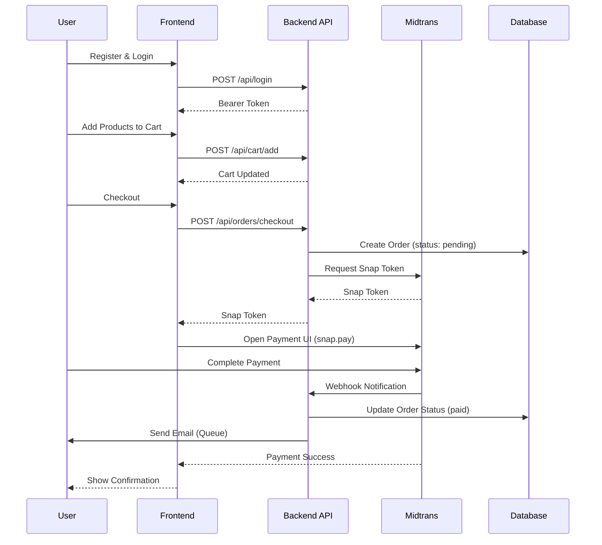

<div align="center">

# 💳 Payment Gateway API

### Backend E-Commerce dengan Integrasi Payment Gateway Midtrans

[](https://laravel.com)
[](https://www.php.net/)
[](https://www.postgresql.org/)
[](https://www.docker.com/)
[](#testing)

[🚀 Live Demo](#) • [📖 Dokumentasi API](http://localhost:8000/api/documentation) • [📊 Arsitektur](#arsitektur) • [🧪 Testing](#testing)

</div>

---

## 📌 Tentang Project

**Backend API lengkap** untuk aplikasi e-commerce dengan sistem pembayaran menggunakan **Midtrans Snap**, dibangun dengan prinsip **Clean Architecture** dan fitur production-ready seperti automated testing, queue system, task scheduling, dan Docker containerization.

**🎯 Tujuan Project**: Mendemonstrasikan kemampuan development Laravel tingkat enterprise dengan fokus pada **skalabilitas**, **kemudahan testing**, dan **maintainability**.

### ✨ Fitur Unggulan

- 🏗️ **Clean Architecture** - Repository Pattern, Service Layer, DTOs
- 🧪 **52 Automated Tests** - Test coverage lengkap dengan Pest/PHPUnit
- 🔄 **Queue System** - Proses email async, penanganan webhook
- ⏰ **Task Scheduler** - Pengingat order otomatis, cleanup jobs
- 🐳 **Docker Ready** - Multi-container setup untuk development & production
- 📚 **Dokumentasi API** - Dokumentasi interaktif Swagger/OpenAPI
- 🔒 **Security First** - Autentikasi JWT, API rate limiting, validasi input
- 💾 **Transaction Safety** - Database transactions, rollback saat gagal

---

## 🚀 Fitur Lengkap

### 🔐 Autentikasi & Otorisasi
- **JWT Authentication** dengan tymon/jwt-auth
- **RBAC (Role-Based Access Control)** menggunakan Spatie Permission
- 3 Role: Admin, Customer, Merchant
- Password hashing dengan bcrypt
- Token refresh & revocation

### 🛒 Sistem Keranjang Belanja
- Tambah/Update/Hapus produk dari cart
- Validasi stok real-time
- Cart persistence across sessions
- Checkout multi-item sekaligus

### 📦 Manajemen Order
- Lifecycle order lengkap (Pending → Paid → Processing → Completed)
- History order dengan filtering
- Update status order otomatis
- Pembatalan order dengan restorasi stok

### 💳 Integrasi Pembayaran
- Integrasi **Midtrans Snap**
- Multiple metode pembayaran (Kartu Kredit, E-Wallet, Transfer Bank)
- Penanganan webhook notification
- Verifikasi & keamanan pembayaran
- History transaksi

### 📧 Notifikasi Email
- Email konfirmasi order
- Update status pembayaran
- Proses email async dengan queue
- Pengingat otomatis untuk order belum dibayar

### 🖼️ Manajemen Produk
- CRUD operasi produk
- Support multiple gambar produk
- Tracking & manajemen stok
- Kategori & pricing

### 📊 Admin Dashboard API
- Statistik order
- Laporan revenue
- Manajemen user
- Tracking inventory produk

---

## 🏗️ Arsitektur

Project ini mengikuti prinsip **Clean Architecture** dengan pemisahan concerns yang jelas:

```
┌─────────────────────────────────────────────────────────┐
│                  API Layer (Routes)                      │
├─────────────────────────────────────────────────────────┤
│              Controllers (HTTP Handling)                 │
├─────────────────────────────────────────────────────────┤
│         Requests (Validation) │ Resources (Response)     │
├─────────────────────────────────────────────────────────┤
│              Services (Business Logic)                   │
├─────────────────────────────────────────────────────────┤
│         Repositories (Data Access Abstraction)           │
├─────────────────────────────────────────────────────────┤
│              Models (Eloquent ORM)                       │
├─────────────────────────────────────────────────────────┤
│                    Database                              │
└─────────────────────────────────────────────────────────┘
```

**Keuntungan:**
- 🔄 Mudah di-test (mockable dependencies)
- 🔧 Mudah di-maintain (single responsibility)
- 🚀 Mudah di-extend (open-closed principle)
- 🔌 Framework agnostic (switchable data layer)

---

## 🛠️ Tech Stack

| Teknologi | Versi | Kegunaan |
|-----------|-------|----------|
| **Laravel** | 12.x | PHP Framework |
| **PHP** | 8.4 | Bahasa Pemrograman |
| **PostgreSQL** | 16 | Database Utama |
| **Redis** | 7 | Cache & Queue Backend |
| **Docker** | 29.1.2 | Containerization |
| **JWT (tymon/jwt-auth)** | 2.2 | API Authentication |
| **Spatie Permission** | 6.23 | RBAC (Role Management) |
| **Midtrans** | 2.x | Payment Gateway |
| **Guzzle** | 7.x | HTTP Client |
| **MailHog** | - | Email Testing (Dev) |

---

## 🐳 Quick Start with Docker (Recommended)

### Prerequisites
- Docker Desktop installed ([Download](https://www.docker.com/products/docker-desktop))
- Git installed

### Run in 3 Commands

```bash
# 1. Clone & navigate
git clone <your-repo-url>
cd payment-gateway-simple-api-

# 2. Start all containers (Laravel, PostgreSQL, Redis, MailHog)
docker-compose -f docker-compose.dev.yml up -d

# 3. Run database migrations
docker-compose -f docker-compose.dev.yml exec app php artisan migrate --seed
```

**🎉 Done!** API available at: http://localhost:8000

**Services Running:**
- 🌐 API Server: http://localhost:8000
- 📖 API Documentation: http://localhost:8000/api/documentation
- 📧 MailHog UI: http://localhost:8025
- 🐘 PostgreSQL: localhost:5432
- 🔴 Redis: localhost:6379

**View Logs:**
```bash
docker-compose -f docker-compose.dev.yml logs -f app
```

**Stop Containers:**
```bash
docker-compose -f docker-compose.dev.yml down
```

> 📚 **Need Help with Docker?** Check [DOCKER_SETUP_GUIDE.md](docs/DOCKER_SETUP_GUIDE.md) for complete explanations.

---

## 💻 Local Installation (Without Docker)

### Prerequisites
- PHP 8.4+
- Composer
- PostgreSQL 16+
- Redis (optional, can use `sync` driver)

### Steps

```bash
# 1. Clone repository
git clone <your-repo-url>
cd payment-gateway-simple-api-

# 2. Install dependencies
composer install

# 3. Configure environment
cp .env.example .env
php artisan key:generate

# 4. Configure database in .env
# DB_CONNECTION=pgsql
# DB_HOST=127.0.0.1
# DB_PORT=5432
# DB_DATABASE=payment_gateway
# DB_USERNAME=your_user
# DB_PASSWORD=your_password

# 5. Run migrations & seeders
php artisan migrate --seed

# 6. Start development server
php artisan serve

# 7. (Optional) Start queue worker
php artisan queue:work

# 8. (Optional) Start task scheduler (in cron or separate terminal)
php artisan schedule:work
```

**API available at:** http://localhost:8000

---

## 🔑 Midtrans Configuration

### 1. Create Midtrans Account
Sign up at [Midtrans Dashboard](https://dashboard.midtrans.com/)

### 2. Get API Keys (Sandbox Mode)
- Navigate to **Settings** → **Access Keys**
- Copy **Server Key** and **Client Key**

### 3. Configure Environment Variables

Add to your `.env` file:

```env
MIDTRANS_SERVER_KEY=SB-Mid-server-xxxxxxxxxxxx
MIDTRANS_CLIENT_KEY=SB-Mid-client-xxxxxxxxxxxx
MIDTRANS_IS_PRODUCTION=false
MIDTRANS_IS_SANITIZED=true
MIDTRANS_IS_3DS=true
```

### 4. Setup Webhook URL (Important!)

In Midtrans Dashboard:
- Go to **Settings** → **Configuration**
- Set **Payment Notification URL** to:
  ```
  https://your-domain.com/api/midtrans/webhook
  ```
- For local testing with ngrok:
  ```bash
  ngrok http 8000
  # Use: https://xxxx.ngrok.io/api/midtrans/webhook
  ```

### 5. Test Payment

Use Midtrans test cards ([Full List](https://docs.midtrans.com/en/technical-reference/sandbox-test)):

| Card Number | Result |
|-------------|--------|
| `4811 1111 1111 1114` | Success |
| `4911 1111 1111 1113` | Denied |

---

## 📡 API Documentation

### Interactive Swagger UI

Explore all **17 endpoints** with live testing:

**🔗 [http://localhost:8000/api/documentation](http://localhost:8000/api/documentation)**

### Endpoints Overview

#### 🔐 Authentication (2 endpoints)
```http
POST   /api/register     # Register new user
POST   /api/login        # Login & get bearer token
```

#### 🛍️ Products (3 endpoints)
```http
GET    /api/products          # List all products
GET    /api/products/{id}     # Get product details
POST   /api/products          # Create product (Admin)
```

#### 🛒 Cart (3 endpoints)
```http
POST   /api/cart/add          # Add product to cart
GET    /api/cart              # View cart items
DELETE /api/cart/{id}         # Remove item from cart
```

#### 📦 Orders (4 endpoints)
```http
POST   /api/orders/checkout   # Checkout cart → create order
GET    /api/orders            # List user's orders
GET    /api/orders/{id}       # Get order details
POST   /api/orders/{id}/cancel # Cancel unpaid order
```

#### 💳 Payments (3 endpoints)
```http
POST   /api/payments/create-snap-token  # Get Midtrans token
POST   /api/payments/verify              # Verify payment status
GET    /api/payments/history             # Payment history
```

#### 🔔 Webhooks (2 endpoints)
```http
POST   /api/midtrans/webhook      # Midtrans payment callback
POST   /api/webhooks/test         # Test webhook handler
```

### Example Request

```bash
# 1. Register
curl -X POST http://localhost:8000/api/register \
  -H "Content-Type: application/json" \
  -d '{"name":"John","email":"john@example.com","password":"password123"}'

# 2. Login
curl -X POST http://localhost:8000/api/login \
  -H "Content-Type: application/json" \
  -d '{"email":"john@example.com","password":"password123"}'

# 3. Add to Cart (use token from login)
curl -X POST http://localhost:8000/api/cart/add \
  -H "Authorization: Bearer YOUR_TOKEN" \
  -H "Content-Type: application/json" \
  -d '{"product_id":1,"quantity":2}'
```

> 💡 **Tip:** Import [LaravelShop.postman_collection.json](LaravelShop.postman_collection.json) for pre-configured requests.

---

## 💳 Payment Flow



**Steps:**
1. **Register/Login** → Get authentication token
2. **Browse Products** → View available items
3. **Add to Cart** → Select products & quantities
4. **Checkout** → Backend creates order & requests Midtrans token
5. **Pay** → Frontend displays Midtrans payment UI
6. **Webhook** → Midtrans notifies backend of payment status
7. **Update** → Backend updates order & sends email notification

---

## 🧪 Testing

### Run All Tests (52 tests)

```bash
# Using Pest
./vendor/bin/pest

# Using PHPUnit
php artisan test

# With coverage
php artisan test --coverage
```

### Test Structure

```
tests/
├── Feature/              # Integration tests
│   ├── AuthTest.php     # Registration & login
│   ├── CartTest.php     # Cart operations
│   ├── OrderTest.php    # Order creation & flow
│   └── PaymentTest.php  # Midtrans integration
└── Unit/                # Unit tests
    ├── Services/        # Service layer tests
    ├── Repositories/    # Repository tests
    └── Models/          # Model relationship tests
```

### Test Coverage Highlights

- ✅ **52 passing tests** covering:
  - Authentication flows
  - Cart operations (add, update, delete)
  - Order lifecycle (pending → paid → completed)
  - Payment processing & webhooks
  - Stock validation & restoration
  - Email queue jobs
  - Repository patterns
  - Service layer logic

### Example Test Output

```
PASS  Tests\Feature\AuthTest
✓ user can register with valid data
✓ user cannot register with invalid email
✓ user can login with correct credentials

PASS  Tests\Feature\OrderTest
✓ user can checkout cart and create order
✓ order status updates on payment confirmation
✓ stock reduces after successful order

Tests:    52 passed (146 assertions)
Duration: 3.24s
```

---

## 🔄 Queue System

### Background Jobs

The application uses **Redis-backed queues** for async processing:

#### 📧 Email Jobs
- **SendOrderReminderJob** - Sends reminder for unpaid orders
- **OrderConfirmationMail** - Confirmation email after payment

#### 🔔 Webhook Processing
- **ProcessMidtransWebhook** - Handles Midtrans payment notifications
- Retry strategy: 3 attempts with exponential backoff

### Start Queue Worker

```bash
# Process jobs from default queue
php artisan queue:work

# With options
php artisan queue:work --queue=high,default,low --tries=3 --timeout=90

# In Docker
docker-compose -f docker-compose.dev.yml exec app php artisan queue:work
```

### Monitor Queues

```bash
# View failed jobs
php artisan queue:failed

# Retry failed job
php artisan queue:retry {id}

# Clear failed jobs
php artisan queue:flush
```

---

## ⏰ Task Scheduler

### Automated Tasks

The scheduler runs these commands automatically:

| Task | Schedule | Description |
|------|----------|-------------|
| **Order Reminders** | Daily 10:00 AM | Send reminder for unpaid orders |
| **Cleanup Old Carts** | Daily 2:00 AM | Remove abandoned carts (7+ days) |
| **Cache Refresh** | Every 6 hours | Refresh product cache |

### Start Scheduler (Local)

```bash
# Option 1: Continuous mode (development)
php artisan schedule:work

# Option 2: Add to cron (production)
* * * * * cd /path-to-project && php artisan schedule:run >> /dev/null 2>&1
```

### View Scheduled Tasks

```bash
php artisan schedule:list
```

---

## 📂 Project Structure

```
├── app/
│   ├── Http/
│   │   ├── Controllers/    # API endpoints
│   │   ├── Requests/       # Validation rules
│   │   └── Resources/      # Response formatting
│   ├── Services/           # Business logic
│   ├── Repositories/       # Data access layer
│   ├── Models/             # Eloquent models
│   ├── Jobs/               # Queue jobs
│   ├── Mail/               # Email templates
│   ├── Enums/              # Status enums
│   └── Helpers/            # Helper functions
├── database/
│   ├── migrations/         # Database schema
│   ├── seeders/            # Test data
│   └── factories/          # Model factories
├── tests/
│   ├── Feature/            # Integration tests
│   └── Unit/               # Unit tests
├── docs/
│   ├── DOCKER_SETUP_GUIDE.md      # Complete Docker tutorial
│   └── GITLAB_CICD_SETUP.md       # CI/CD implementation guide
├── docker-compose.dev.yml  # Development containers
├── Dockerfile.dev          # PHP 8.4 + extensions
└── README.md               # This file
```

---

## 🚀 Deployment

### Option 1: Railway (Recommended for beginners)

**Free tier available, automatic HTTPS, easy setup**

1. Push code to GitHub/GitLab
2. Connect Railway to your repository
3. Add PostgreSQL database addon
4. Set environment variables
5. Deploy automatically on push

> 📖 **Complete Guide:** See [docs/GITLAB_CICD_SETUP.md](docs/GITLAB_CICD_SETUP.md) for CI/CD automation

### Option 2: VPS (DigitalOcean, Linode, AWS)

Use Docker Compose for production:

```bash
# On server
docker-compose -f docker-compose.prod.yml up -d
docker-compose exec app php artisan migrate --force
```

### Environment Checklist

Before deploying to production:

- [ ] Set `APP_ENV=production`
- [ ] Set `APP_DEBUG=false`
- [ ] Generate new `APP_KEY`
- [ ] Use production database
- [ ] Set `MIDTRANS_IS_PRODUCTION=true`
- [ ] Configure real email SMTP
- [ ] Setup domain & HTTPS
- [ ] Configure CORS properly
- [ ] Setup Redis for cache/queue
- [ ] Add cron for scheduler
- [ ] Configure webhook URL in Midtrans

---

## 🤝 Contributing

Contributions are welcome! Please follow these steps:

1. Fork the repository
2. Create feature branch (`git checkout -b feature/amazing-feature`)
3. Commit changes (`git commit -m 'Add amazing feature'`)
4. Push to branch (`git push origin feature/amazing-feature`)
5. Open Pull Request

### Development Guidelines

- Follow PSR-12 coding standards
- Write tests for new features
- Update documentation
- Keep commits atomic and descriptive

---

## 📝 License

This project is open-sourced under the [MIT License](LICENSE).

---

## 📬 Contact & Links

**Developer:** [Your Name]

- 🌐 Portfolio: [your-website.com](https://your-website.com)
- 💼 LinkedIn: [linkedin.com/in/yourprofile](https://linkedin.com/in/yourprofile)
- 📧 Email: your.email@example.com
- 💻 GitHub: [github.com/yourusername](https://github.com/yourusername)

---

## 🙏 Acknowledgments

- [Laravel Framework](https://laravel.com)
- [Midtrans Payment Gateway](https://midtrans.com)
- [Swagger/OpenAPI](https://swagger.io)
- [Docker](https://docker.com)

---

<div align="center">

**⭐ Star this repo if you find it helpful!**

Made with ❤️ for portfolio showcase

</div>
